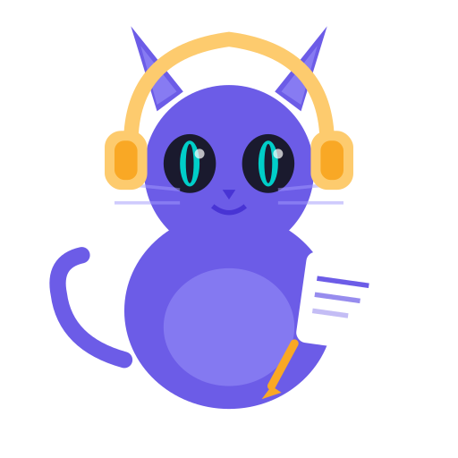

<p align="center">
  
</p>

<h1 align="center">Meeting Recorder</h1>

<p align="center">
  Record. Transcribe. Summarize.
</p>

<p align="center">
  <a href="https://aur.archlinux.org/packages/meeting-recorder"></a>
  <a href="LICENSE"></a>
</p>

<p align="center">
  A Linux desktop app that records meetings, transcribes them, and generates structured notes — all in a few clicks.<br>
  Supports cloud and local AI processing, with 100+ providers via LiteLLM.<br>
  <strong>Arch Linux</strong> &middot; PipeWire + Wayland &middot; GTK3
</p>

---

## Quick Start

```bash
# Install from AUR
yay -S meeting-recorder    # or: paru -S meeting-recorder

# Launch
meeting-recorder
```

Open **Settings**, pick your transcription and summarization providers, add API keys, and you're ready to record.

> For fully offline use, select **Whisper** (transcription) + **Ollama** via LiteLLM (summarization) — no API keys needed.

---

## Features

### Recording

- **Two modes** — *Headphones* (mic + system audio) or *Speaker* (mic only, avoids echo)
- **Pause / Resume** mid-recording
- **Separate audio tracks** — optionally save mic and system audio as independent files for better diarization
- **Transcribe existing files** — drop in any audio/video file for transcription without recording

### Transcription

| Provider | How it works | Requires |
|---|---|---|
| **Google Gemini** | Audio uploaded to Gemini multimodal API | API key |
| **ElevenLabs Scribe v2** | Native diarization, up to 32 speakers | API key |
| **Whisper** | Runs locally via faster-whisper, GPU-accelerated if CUDA available | Model download (~500 MB – 3 GB) |
| **LiteLLM** | Routes to Groq, OpenAI, Deepgram, and more | Provider API key |

### Summarization

| Provider | How it works | Requires |
|---|---|---|
| **Claude Code CLI** | Shells out to `claude --print` | Claude Code subscription |
| **LiteLLM** | Routes to Gemini, Ollama, OpenAI, Anthropic, OpenRouter, etc. | Provider API key (or local Ollama) |

Mix and match freely — e.g. Whisper + Ollama runs fully offline with no API keys.

### Screen Recording

- **Per-monitor** Wayland-native capture via gpu-screen-recorder
- **Merge with audio** — optionally combine screen recording + audio into a single video
- **Night light inhibition** — automatically pauses KDE night light during recording for accurate colors

### Meeting Explorer

- Browse all recorded meetings in a searchable list
- **AI-generated titles** — auto-name meetings from their notes, or generate titles manually
- **Inline rename** — double-click to rename any meeting
- Open folders, delete recordings, bulk-select

### Smart Features

- **Call detection** — monitors PipeWire for active calls and notifies you to start recording
- **Auto-title** — AI generates a short title from your meeting notes after processing
- **Artifact cleanup** — choose which output files to keep (audio, transcripts, screen recordings, notes)
- **GPU memory management** — automatically unloads models between pipeline steps to prevent OOM on limited VRAM
- **System tray** — StatusNotifierItem on KDE (pystray fallback), configurable click actions, background job status
- **Autostart** — optionally launch on login

---

## How It Works

1. Click **Record (Headphones)** or **Record (Speaker)** to start
2. Pause / Resume as needed — a timer shows elapsed time
3. Click **Stop** — transcription and summarization run automatically
4. Browse results in the app or open the output folder

Each session saves to a dated hierarchy:

```
~/meetings/
└── 2026/
    └── March/
        └── 04/
            └── 14-30_Standup/
                ├── recording.mp3              # Combined audio
                ├── recording_mic.mp3          # Mic track (if separate tracks)
                ├── recording_system.mp3       # System track (if separate tracks)
                ├── screen-eDP-1.mp4           # Screen recording (if enabled)
                ├── screen-eDP-1_merged.mp4    # Screen + audio merged (if enabled)
                ├── transcript.md
                └── notes.md
```

---

## Providers & Model Strings

LiteLLM routes to providers via the model string prefix:

```
gemini/gemini-2.5-flash              # Google Gemini
ollama/phi4-mini                     # Local Ollama
openai/gpt-4o                        # OpenAI
anthropic/claude-sonnet-4-latest     # Anthropic
openrouter/anthropic/claude-sonnet-4 # OpenRouter
groq/whisper-large-v3                # Groq (transcription)
```

Select from curated lists in Settings, or type any `provider/model` string.

| Provider | Requirement |
|---|---|
| **Gemini** | API key from [aistudio.google.com](https://aistudio.google.com) |
| **ElevenLabs** | API key from [elevenlabs.io](https://elevenlabs.io) |
| **Whisper** | Model downloaded in Settings → Model Config |
| **Ollama** | [Ollama](https://ollama.com) installed and running |
| **Claude Code** | [Claude Code CLI](https://docs.anthropic.com/en/docs/claude-code/overview) installed and on PATH |
| **Other LiteLLM providers** | API key set in Settings → API Keys |

---

## Installation

### AUR (recommended)

```bash
yay -S meeting-recorder
# or
paru -S meeting-recorder
```

### From Source

```bash
git clone https://github.com/AJV009/meeting-recorder.git
cd meeting-recorder
./install.sh
```

Installs system deps via pacman, sets up a Python venv via uv, and auto-installs gpu-screen-recorder from AUR if yay/paru is available.

### Uninstall

```bash
./uninstall.sh
```

> Your recordings (`~/meetings/`) and config (`~/.config/meeting-recorder/`) are preserved.

### Requirements

- Arch Linux with PipeWire (tested on KDE Plasma 6 / Wayland)
- `ffmpeg`, `pipewire`, `pipewire-pulse`, `wireplumber`, Python 3, GTK3
- Optional: `gpu-screen-recorder` (AUR) for screen recording

---

## Configuration

Open **Settings** from the gear icon or system tray menu. Settings are organized into tabs:

| Tab | What it controls |
|---|---|
| **General** | Transcription/summarization providers, LiteLLM model, output folder, quality, timeout, autostart, call detection, auto-title |
| **Platform** | Separate audio tracks, screen recording (monitors, FPS, merge), night light inhibition |
| **Model Config** | Gemini model, Whisper model download, Ollama model + host + pull |
| **API Keys** | Provider API keys (Gemini, OpenAI, Anthropic, Groq, OpenRouter, ElevenLabs, Deepgram) |
| **Prompts** | Custom transcription and summarization prompts with reset-to-default |
| **Artifacts** | Choose which output files to keep after processing |
| **Tray** | Default click action when idle and when recording |

<details>
<summary><strong>Whisper models</strong></summary>

| Model | Size | Notes |
|---|---|---|
| `large-v3-turbo` | ~1.6 GB | High quality, 8x faster than large-v3 — recommended |
| `distil-large-v3` | ~1.5 GB | Fast, near-large quality |
| `large-v3` | ~3 GB | Best accuracy, slow on CPU |
| `medium` | ~1.5 GB | Good balance |
| `small` | ~500 MB | Fast, lower accuracy |

GPU acceleration is automatic if CUDA is available.

</details>

<details>
<summary><strong>Ollama models (curated)</strong></summary>

| Model | Size | Notes |
|---|---|---|
| `phi4-mini` | ~3 GB | Lightest, good quality |
| `gemma3:4b` | ~4 GB | Good quality |
| `qwen2.5:7b` | ~5 GB | Very capable |
| `llama3.1:8b` | ~5 GB | Very capable |
| `gemma3:12b` | ~8 GB | Best quality, needs more RAM |

</details>

<details>
<summary><strong>Prompt customization</strong></summary>

Edit transcription and summarization prompts in Settings → Prompts. Each has a **Reset to default** button. The `{transcript}` placeholder in the summarization prompt is replaced with the transcript text.

Note: transcription prompts apply to Gemini direct provider only — Whisper, ElevenLabs, and LiteLLM providers do not use custom prompts.

</details>

---

## Tips & Troubleshooting

<details>
<summary><strong>Noise reduction</strong></summary>

Enable PipeWire's WebRTC noise suppression:

**Temporary (current session):**
```bash
pactl load-module module-echo-cancel aec_method=webrtc noise_suppression=true
```

**Permanent** — create `~/.config/pipewire/pipewire-pulse.conf.d/echo-cancel.conf`:
```
pulse.cmd = [
  { cmd = "load-module" args = "module-echo-cancel aec_method=webrtc noise_suppression=true" flags = [] }
]
```

Then restart PipeWire:
```bash
systemctl --user restart pipewire pipewire-pulse
```

</details>

<details>
<summary><strong>Logs</strong></summary>

```
~/.local/share/meeting-recorder/meeting-recorder.log
```

</details>

<details>
<summary><strong>Recovering corrupted screen recordings</strong></summary>

If a screen recording is missing the moov atom (e.g. due to a crash), you can attempt recovery with ffmpeg:

```bash
ffmpeg -i corrupted.mp4 -c copy recovered.mp4
```

</details>

---

## Development

```bash
git clone https://github.com/AJV009/meeting-recorder.git
cd meeting-recorder
python3 -m venv .venv --system-site-packages
.venv/bin/pip install -e ".[dev]"
PYTHONPATH=src python3 -m meeting_recorder
```

Run tests:
```bash
python -m pytest tests/ -v
```

---

## License

MIT
